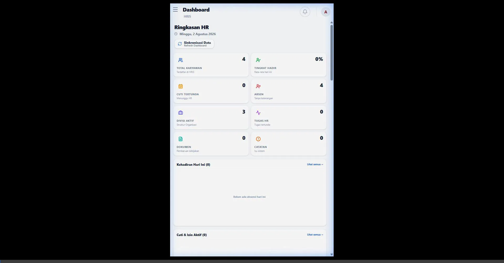
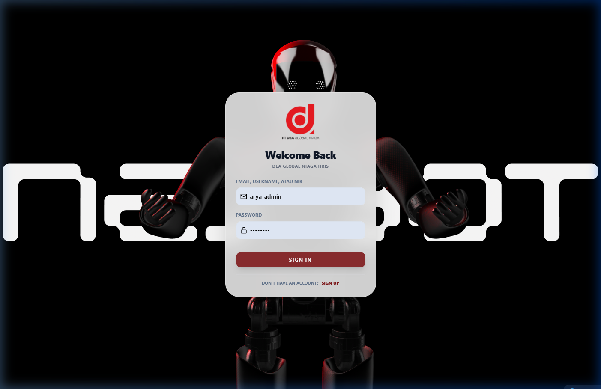
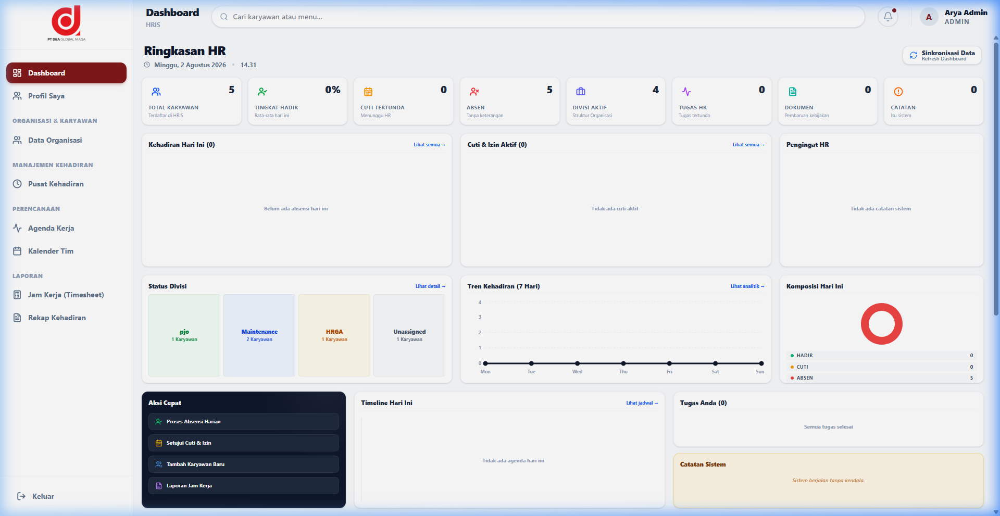
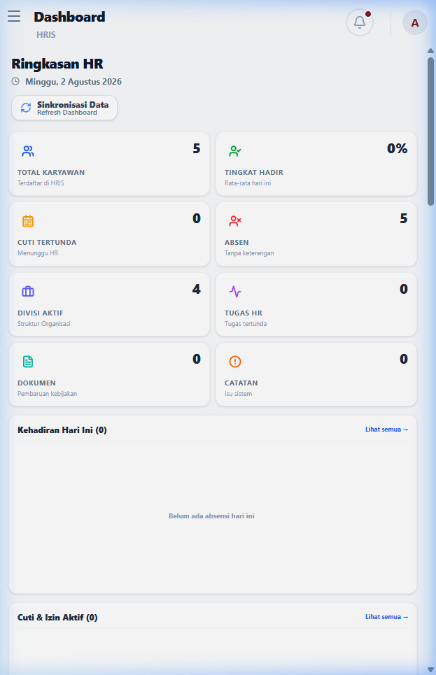
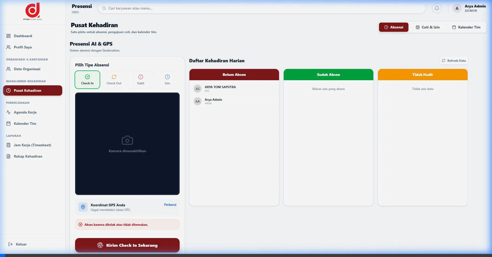

# 🚀 DEA HRIS v1.1 - The Next Generation HR Platform

Selamat datang di **DEA HRIS v1.1**, platform Manajemen Sumber Daya Manusia berbasis *role-based access control* (RBAC) yang cerdas, efisien, dan modern. Kami berfokus pada pengalaman pengguna yang estetik (UI/UX) dipadukan dengan mesin otomasi tingkat lanjut di latar belakang.

---

## 🌟 Cuplikan Interaktif (Dokumentasi Web)

> 💡 *Klik pada masing-masing judul di bawah ini untuk membuka video demonstrasi dan dokumentasi layar penuh!*

<b>1️⃣ Halaman Login Tersentralisasi (Smart Auth)</b>

 

Login satu pintu untuk seluruh hierarki perusahaan. Sistem HRIS DEA secara cerdas mendeteksi *Role* (Jabatan & Departemen) Anda, mengarahkan Anda ke *Dashboard* yang tepat seketika itu juga! Mendukung perlindungan sandi berlapis.

<b>2️⃣ Dinamika Dashboard (Animasi Pergerakan)</b>

 

Sistem HRIS ini dilengkapi dengan transisi halus, interaksi *hover*, dan efek *glassmorphism* modern.  

<b>3️⃣ Tampilan Khusus: Eksekutif (Admin/HR) vs Karyawan</b>

 

Setiap jabatan mendapat panel kendali (*tailored dashboard*) yang disesuaikan dengan tanggung jawab mereka:

**👑 Admin & HR Dashboard:** Tampilan penuh data analitik tingkat lanjut, matriks organisasi, grafik rasio karyawan, dan notifikasi persetujuan Cuti/Izin yang menunggu validasi.

**🧑‍💼 Karyawan Dashboard:** Tampilan personal yang rapi. Fokus pada informasi penting: Sisa kuota cuti tahunan, kalender absensi harian, dan matriks performa pribadi tanpa terdistraksi dengan metrik perusahaan.

<b>4️⃣ Smart Attendance Hub (Fitur Absensi Berjalan)</b>

 

Modul absensi kami yang revolusioner. Karyawan dapat memantau waktu berjalan secara sinkron (tersinkronisasi via WITA). Dilengkapi deteksi lokasi geografis *(Geolocation API)* yang mengunci area absensi khusus hanya di zona radius pabrik/kantor.

---

## 🎭 Role-Based Access Control (RBAC)
Keamanan aplikasi dijaga menggunakan filter sistem *Routing* canggih di Frontend dan Backend:

| Tingkat Akses | Kewenangan Utama |
|---|---|
| 👑 **Super Admin** | Akses Tertinggi (Manajemen Cabang Organisasi, Laporan Total, Pengaturan Konfigurasi Server). |
| 🛡️ **HSE Admin** | Memvalidasi persetujuan Sertifikasi K3, memantau *Compliance Matrix*, & Standar Keselamatan. |
| 👥 **HR/Admin** | Meninjau Form Cuti, Menyetujui Izin Sakit, Penyesuaian Jam Absensi, Manajemen Data Karyawan. |
| 🧑‍💼 **Karyawan** | Melakukan absensi harian (Check-In/Out), Ajukan Cuti/Sertifikat, Download *Payslip* (Slip Gaji). |

---

## 🔔 Otomasi & Real-Time Push Notifications
Platform tidak pasif. Sistem HRIS DEA v1.1 proaktif menjangkau karyawannya dengan protokol VAPID (*Service Worker*):

* 🕒 **Pengingat Harian (Cron Scheduler):** 
  Sistem membangunkan API harian pada **08:30 WITA** untuk mengingatkan yang belum absen masuk, dan pada **17:30 WITA** mengingatkan yang lupa absen pulang. Notifikasi langsung menyala di ponsel!
* ✅ **Workflow Persetujuan:** 
  Tidak perlu me-refresh halaman! Dapatkan notifikasi *real-time* begitu Cuti, Izin, atau Sertifikat kompetensi Anda disetujui (atau ditolak beserta alasannya) oleh tim HR.
* 📅 **Pengumuman Agenda Operasional:** 
  Ketika HR menambahkan Acara Perusahaan baru, seluruh Karyawan otomatis menerima getaran notifikasi acara baru di PC maupun Smartphone mereka.

---

## 🛠️ Stack Teknologi Di Balik Layar
Aplikasi HRIS berkinerja tinggi ini dibangun di atas pondasi masa depan:
- **Frontend Layer:** `React 18` + `Vite` (Sangat Cepat), diperindah dengan `Tailwind CSS`.
- **Backend Service:** `Node.js` + `Express` dengan *REST API Architecture*.
- **Database Engine:** `Supabase` (PostgreSQL 15) dengan *Row Level Security (RLS)*.
- **PWA & Edge Ready:** Modul Web Push Notifications, Service Workers, terkompresi secara optimal untuk performa *mobile*.

---
> *Dikembangkan secara eksklusif untuk kemajuan digital PT DEA Global Niaga.* 🇮🇩
